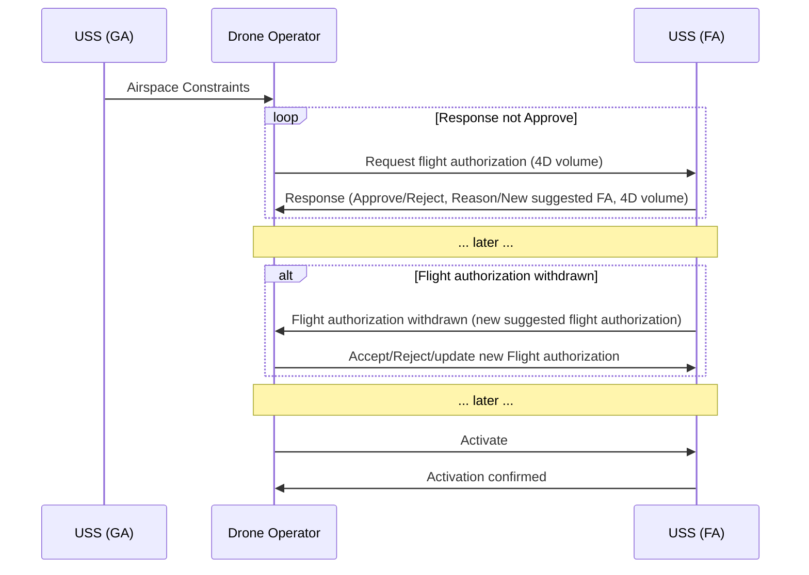

## Flight Authorization

This U-space service handles the authorization of flights.



### Request Plan

Initiate a request for a flight authorization

```json
{
  "message type": "request plan",
  "operator ID": "b98d872e-9f7a-11ec-9352-00155dfec23b",
  "EPSG": 4979,
  "plan": [node_1, node_2, ..., node_n],
  "when": "2022-03-09T07:38:21.949394",
  "speed": 20.0
}
```

Parameter description:

- **operator ID** *[string]*

  the operator ID (uuid)

- **EPSG** *[integer]*

  the coordinate system used (default WGS 84)

- **plan** *[array<nodes>]*

  The pre-defined points to visit

- **when** *[string]*

  The desired take-off time (in UTC)

- **speed** *[double]*

  The default speed of the drone

A node in a plan request contains the following information:

- **type** *[string]*

  Any of "2D path", "3D path", "free flight"

- **position** *[array<double, double>]*

  The position of the node. The dimension of the array depends on
  type.

> ❗TODO: List all available types instead of only the "2D Path"

Response:

```json
{
  "message type": "response",
  "plan ID": "2e52919e-9f7b-11ec-8d22-00155dfec23b",
  "delay": 5.0
}
```

- **plan ID** *[string]*

  the flight authorization ID (uuid)

- **delay** *[double]*

  the amount of time in seconds required by the USSP to compute the
  plan

### Get Plan

Ask the USSP to return the flight authorization

```json
{
  "message type": "get plan",
  "plan ID": "2e52919e-9f7b-11ec-8d22-00155dfec23b"
}
```

Parameter description:

- **plan ID** *[string]*

  the flight authorization ID (uuid)

Response:

```json
{
  "message type": "response",
  "response": "authorized",
  "message": "",
  "plan": [node_1, node_2, …, node_n]
}
```

- **response** *[string]*

  "not ready", "invalid id", "not authorized", "authorized", "error"

- **message** *[string]* (optional attribute)

  Explains the reason of error. Only used when "response" is not
  "authorized"

- **plan** *[array<nodes>]*

  A copy of the authorized plan

A node in an authorized plan contains the following information:

```json
{
  "type": "3D path",
  "position": [15.659466, 58.410726999999994, 0.0],
  "positional margins": [50, 20],
  "time": "2022-03-09T07:43:14.859688",
  "time margin": 30
}
```

- **type** *[string]*

  "3D path", "free flight"

- **position** *[double, double, double]*

  The position of the node (typically lat, lon, relative altitude)

- **positional margin** *[double, double]*

  The horizontal and vertical margins (meter?)

- **time** *[string]*

  The time when the node is expected to be reached (UTC ISO format)

- **time margin** *[double]*

  What does this parameter mean?

### Accept Plan

> ❗TODO: NOT IMPLEMENTED

### Cancel Plan

> ❗TODO: NOT IMPLEMENTED

### Activate Plan

> ❗TODO: NOT IMPLEMENTED
